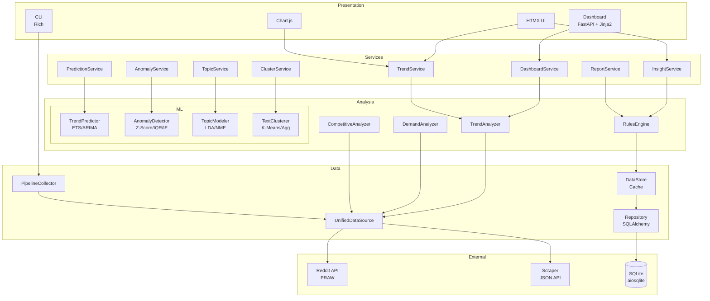

# System Architecture

Reddit Insight의 시스템 아키텍처 문서입니다.

## 목차

1. [시스템 개요](#시스템-개요)
2. [컴포넌트 구조](#컴포넌트-구조)
3. [데이터 흐름](#데이터-흐름)
4. [기술 스택](#기술-스택)
5. [디렉토리 구조](#디렉토리-구조)
6. [확장 가이드](#확장-가이드)

---

## 시스템 개요

Reddit Insight는 Reddit 데이터를 수집, 분석하여 비즈니스 인사이트를 제공하는 종합 분석 플랫폼입니다.

### 아키텍처 다이어그램

```
┌─────────────────────────────────────────────────────────────────────────────┐
│                              Reddit Insight                                  │
├─────────────────────────────────────────────────────────────────────────────┤
│                                                                              │
│  ┌──────────────────────────────────────────────────────────────────────┐   │
│  │                     PRESENTATION LAYER                                │   │
│  │  ┌─────────────┐  ┌─────────────┐  ┌─────────────┐  ┌────────────┐  │   │
│  │  │  Dashboard  │  │   HTMX UI   │  │  Chart.js   │  │    CLI     │  │   │
│  │  │  (FastAPI)  │  │  (Partials) │  │  (Charts)   │  │   (Rich)   │  │   │
│  │  └─────────────┘  └─────────────┘  └─────────────┘  └────────────┘  │   │
│  └──────────────────────────────────────────────────────────────────────┘   │
│                                    │                                         │
│                                    ▼                                         │
│  ┌──────────────────────────────────────────────────────────────────────┐   │
│  │                       SERVICE LAYER                                   │   │
│  │  ┌─────────────┐  ┌─────────────┐  ┌─────────────┐  ┌────────────┐  │   │
│  │  │  Dashboard  │  │    Trend    │  │   Insight   │  │   Report   │  │   │
│  │  │   Service   │  │   Service   │  │   Service   │  │   Service  │  │   │
│  │  └─────────────┘  └─────────────┘  └─────────────┘  └────────────┘  │   │
│  │  ┌─────────────┐  ┌─────────────┐  ┌─────────────┐  ┌────────────┐  │   │
│  │  │  Prediction │  │   Anomaly   │  │    Topic    │  │  Cluster   │  │   │
│  │  │   Service   │  │   Service   │  │   Service   │  │   Service  │  │   │
│  │  └─────────────┘  └─────────────┘  └─────────────┘  └────────────┘  │   │
│  └──────────────────────────────────────────────────────────────────────┘   │
│                                    │                                         │
│                                    ▼                                         │
│  ┌──────────────────────────────────────────────────────────────────────┐   │
│  │                       ANALYSIS LAYER                                  │   │
│  │  ┌─────────────┐  ┌─────────────┐  ┌─────────────┐  ┌────────────┐  │   │
│  │  │   Trend     │  │   Demand    │  │ Competitive │  │   Rules    │  │   │
│  │  │  Analyzer   │  │  Analyzer   │  │  Analyzer   │  │   Engine   │  │   │
│  │  └─────────────┘  └─────────────┘  └─────────────┘  └────────────┘  │   │
│  │                                                                       │   │
│  │  ┌──────────────────────────────────────────────────────────────┐    │   │
│  │  │                     ML ANALYZERS                              │    │   │
│  │  │  ┌───────────┐ ┌───────────┐ ┌───────────┐ ┌───────────┐    │    │   │
│  │  │  │  Trend    │ │  Anomaly  │ │   Topic   │ │   Text    │    │    │   │
│  │  │  │ Predictor │ │ Detector  │ │  Modeler  │ │ Clusterer │    │    │   │
│  │  │  └───────────┘ └───────────┘ └───────────┘ └───────────┘    │    │   │
│  │  └──────────────────────────────────────────────────────────────┘    │   │
│  └──────────────────────────────────────────────────────────────────────┘   │
│                                    │                                         │
│                                    ▼                                         │
│  ┌──────────────────────────────────────────────────────────────────────┐   │
│  │                        DATA LAYER                                     │   │
│  │  ┌─────────────┐  ┌─────────────┐  ┌─────────────┐  ┌────────────┐  │   │
│  │  │   Unified   │  │   Pipeline  │  │ Repository  │  │ Data Store │  │   │
│  │  │ DataSource  │  │  Collector  │  │  (SQLAlch)  │  │  (Cache)   │  │   │
│  │  └─────────────┘  └─────────────┘  └─────────────┘  └────────────┘  │   │
│  └──────────────────────────────────────────────────────────────────────┘   │
│                                    │                                         │
│                                    ▼                                         │
│  ┌──────────────────────────────────────────────────────────────────────┐   │
│  │                      EXTERNAL SOURCES                                 │   │
│  │  ┌─────────────┐                              ┌─────────────────┐    │   │
│  │  │ Reddit API  │◄─── Primary ─────────────────│  SQLite (Async) │    │   │
│  │  │   (PRAW)    │                              │                 │    │   │
│  │  └─────────────┘                              └─────────────────┘    │   │
│  │  ┌─────────────┐                                                     │   │
│  │  │  Scraper    │◄─── Fallback (API 제한 시)                          │   │
│  │  │ (JSON API)  │                                                     │   │
│  │  └─────────────┘                                                     │   │
│  └──────────────────────────────────────────────────────────────────────┘   │
│                                                                              │
└─────────────────────────────────────────────────────────────────────────────┘
```

### Mermaid 다이어그램



---

## 컴포넌트 구조

### 1. Presentation Layer

사용자 인터페이스를 담당합니다.

#### Dashboard (FastAPI + Jinja2)

```
src/reddit_insight/dashboard/
├── app.py                  # FastAPI 앱 인스턴스
├── routers/
│   ├── dashboard.py        # 메인 대시보드 라우터
│   ├── trends.py           # 트렌드 시각화 라우터
│   ├── demands.py          # 수요 분석 라우터
│   ├── competition.py      # 경쟁 분석 라우터
│   ├── insights.py         # 인사이트 라우터
│   ├── topics.py           # 토픽 모델링 라우터
│   ├── clusters.py         # 클러스터링 라우터
│   ├── search.py           # 검색 라우터
│   └── api.py              # REST API 라우터 (인증)
└── templates/              # Jinja2 템플릿
```

**핵심 특징**:
- FastAPI의 비동기 처리
- Jinja2 템플릿 엔진
- HTMX를 통한 동적 UI 업데이트
- Chart.js를 통한 데이터 시각화

#### CLI (Rich)

```
src/reddit_insight/cli.py
```

**핵심 명령어**:
- `reddit-insight collect`: 데이터 수집
- `reddit-insight analyze`: 분석 실행
- `reddit-insight dashboard start`: 대시보드 서버 시작
- `reddit-insight report generate`: 리포트 생성

---

### 2. Service Layer

비즈니스 로직과 데이터 변환을 담당합니다.

```
src/reddit_insight/dashboard/services/
├── __init__.py
├── anomaly_service.py      # 이상 탐지 서비스
├── cluster_service.py      # 클러스터링 서비스
├── insight_service.py      # 인사이트 서비스
├── prediction_service.py   # 예측 서비스
├── report_service.py       # 리포트 서비스
├── search_service.py       # 검색 서비스
└── topic_service.py        # 토픽 서비스
```

**서비스 패턴**:
```python
class PredictionService:
    def __init__(self, predictor: TrendPredictor | None = None):
        self._predictor = predictor or TrendPredictor()

    def predict_keyword_trend(
        self,
        keyword: str,
        historical_days: int = 14,
        forecast_days: int = 7,
        confidence_level: float = 0.95,
    ) -> PredictionResult:
        # 데이터 수집 및 변환
        # ML 모델 호출
        # 결과 포맷팅
        ...
```

---

### 3. Analysis Layer

핵심 분석 로직을 담당합니다.

#### 기본 분석기

```
src/reddit_insight/analysis/
├── keywords.py             # 키워드 추출 (YAKE + TF-IDF)
├── trends.py               # 트렌드 분석 (시계열)
├── rising.py               # 급상승 키워드 탐지
├── demand_analyzer.py      # 수요 분석
├── demand_detector.py      # 수요 패턴 탐지
├── competitive.py          # 경쟁 분석
├── sentiment.py            # 감성 분석
└── entity_recognition.py   # 엔티티 인식
```

#### ML 분석기

```
src/reddit_insight/analysis/ml/
├── base.py                 # MLAnalyzerBase 추상 클래스
├── models.py               # 데이터 모델 (PredictionResult, AnomalyResult 등)
├── trend_predictor.py      # 시계열 예측 (ETS/ARIMA)
├── anomaly_detector.py     # 이상 탐지 (Z-Score/IQR/Isolation Forest)
├── topic_modeler.py        # 토픽 모델링 (LDA/NMF)
└── text_clusterer.py       # 텍스트 클러스터링 (K-Means/Agglomerative)
```

**ML 분석기 구조**:

```python
from abc import ABC, abstractmethod

class MLAnalyzerBase(ABC):
    """ML 분석기 기본 추상 클래스."""

    @abstractmethod
    def fit(self, data: Any) -> "MLAnalyzerBase":
        """모델 학습."""
        pass

    @abstractmethod
    def analyze(self, data: Any) -> Any:
        """분석 실행."""
        pass
```

**구현 예시 (TrendPredictor)**:

```python
class TrendPredictor(MLAnalyzerBase):
    """시계열 트렌드 예측기."""

    def fit(self, data: pd.DataFrame) -> "TrendPredictor":
        # ETS 또는 ARIMA 모델 학습
        self._model = ExponentialSmoothing(data).fit()
        return self

    def predict(
        self,
        periods: int,
        confidence_level: float = 0.95
    ) -> PredictionResult:
        forecast = self._model.forecast(periods)
        conf_int = self._model.get_forecast_conf_int(confidence_level)
        return PredictionResult(...)
```

---

### 4. Insights Layer

비즈니스 인사이트 생성을 담당합니다.

```
src/reddit_insight/insights/
├── rules_engine.py         # 규칙 기반 인사이트 생성
├── scoring.py              # 비즈니스 기회 스코어링
└── feasibility.py          # 실행 가능성 분석
```

**인사이트 생성 프로세스**:

```
분석 데이터
    │
    ▼
┌─────────────────┐
│   Rules Engine  │ ← 규칙 기반 패턴 매칭
└─────────────────┘
    │
    ▼
┌─────────────────┐
│    Scoring      │ ← 5차원 점수 계산
└─────────────────┘   (시장규모, 경쟁, 긴급성, 트렌드, 실현가능성)
    │
    ▼
┌─────────────────┐
│  Feasibility    │ ← 실행 가능성 평가
└─────────────────┘   (기술복잡도, 리소스, 시장장벽, 시간가치, 경쟁리스크)
    │
    ▼
Business Insights
```

---

### 5. Data Layer

데이터 수집, 저장, 캐싱을 담당합니다.

#### UnifiedDataSource

API와 스크래핑 간 자동 전환을 지원합니다.

```python
# src/reddit_insight/data_source.py

class UnifiedDataSource:
    """통합 데이터 소스 - API 우선, 스크래핑 폴백."""

    def __init__(self):
        self._api_client = RedditClient()
        self._scraper = RedditScraper()

    async def get_posts(
        self,
        subreddit: str,
        limit: int = 100
    ) -> list[Post]:
        try:
            # API 우선 시도
            return await self._api_client.get_posts(subreddit, limit)
        except APILimitError:
            # 제한 시 스크래핑 폴백
            return await self._scraper.get_posts(subreddit, limit)
```

#### Storage

```
src/reddit_insight/storage/
├── database.py             # 데이터베이스 연결 (async)
├── models.py               # SQLAlchemy 모델
└── repository.py           # Repository 패턴
```

**데이터베이스 스키마**:

```
┌─────────────────┐
│     Posts       │
├─────────────────┤
│ id (PK)         │
│ reddit_id       │
│ subreddit       │
│ title           │
│ content         │
│ author          │
│ created_utc     │
│ score           │
│ num_comments    │
└────────┬────────┘
         │
         │ 1:N
         ▼
┌─────────────────┐
│    Comments     │
├─────────────────┤
│ id (PK)         │
│ post_id (FK)    │
│ reddit_id       │
│ content         │
│ author          │
│ created_utc     │
│ score           │
└─────────────────┘

┌─────────────────┐
│ AnalysisResults │
├─────────────────┤
│ id (PK)         │
│ subreddit       │
│ analyzed_at     │
│ keywords (JSON) │
│ trends (JSON)   │
│ demands (JSON)  │
│ competition     │
│ insights (JSON) │
└─────────────────┘
```

#### DataStore (Cache)

인메모리 캐시로 빠른 데이터 접근을 지원합니다.

```python
# src/reddit_insight/dashboard/data_store.py

class AnalysisData:
    """분석 데이터 캐시 모델."""
    subreddit: str
    analyzed_at: str
    post_count: int
    keywords: list[dict]
    trends: list[dict]
    demands: dict | None
    competition: dict | None
    insights: list[dict]

# 전역 캐시
_current_data: AnalysisData | None = None

def set_current_data(data: AnalysisData) -> None:
    global _current_data
    _current_data = data

def get_current_data(subreddit: str | None = None) -> AnalysisData | None:
    return _current_data
```

---

## 데이터 흐름

### 1. 데이터 수집 흐름

```
사용자 요청 (CLI/Dashboard)
    │
    ▼
┌─────────────────┐
│    Pipeline     │
│    Collector    │
└────────┬────────┘
         │
         ▼
┌─────────────────┐     ┌─────────────────┐
│  UnifiedData    │────►│   Reddit API    │
│    Source       │     │    (PRAW)       │
└────────┬────────┘     └─────────────────┘
         │                      │
         │              (API 제한 시)
         │                      │
         │              ┌─────────────────┐
         │              │   Scraper       │
         │              │  (JSON API)     │
         │              └─────────────────┘
         │
         ▼
┌─────────────────┐
│  Preprocessor   │
│ (정제, 토큰화)  │
└────────┬────────┘
         │
         ▼
┌─────────────────┐
│   Repository    │
│  (SQLAlchemy)   │
└────────┬────────┘
         │
         ▼
    ┌─────────┐
    │ SQLite  │
    └─────────┘
```

### 2. 분석 흐름

```
저장된 데이터
    │
    ▼
┌─────────────────────────────────────────────────────────────┐
│                      Analysis Pipeline                       │
├─────────────────────────────────────────────────────────────┤
│                                                              │
│  ┌─────────────┐  ┌─────────────┐  ┌─────────────────────┐  │
│  │   Keyword   │  │    Trend    │  │       Rising        │  │
│  │  Extractor  │──│   Analyzer  │──│      Detector       │  │
│  │ (YAKE+TFIDF)│  │ (시계열)    │  │  (급상승 탐지)      │  │
│  └─────────────┘  └─────────────┘  └─────────────────────┘  │
│         │                                                    │
│         ▼                                                    │
│  ┌─────────────┐  ┌─────────────┐  ┌─────────────────────┐  │
│  │   Demand    │  │ Competitive │  │     Sentiment       │  │
│  │  Analyzer   │──│  Analyzer   │──│     Analyzer        │  │
│  │ (패턴 매칭) │  │ (엔티티)    │  │   (규칙 기반)       │  │
│  └─────────────┘  └─────────────┘  └─────────────────────┘  │
│         │                                                    │
│         ▼                                                    │
│  ┌─────────────────────────────────────────────────────────┐│
│  │                     ML Analyzers                        ││
│  │  ┌───────────┐ ┌───────────┐ ┌───────────┐ ┌─────────┐ ││
│  │  │ Predictor │ │ Detector  │ │  Modeler  │ │Clusterer│ ││
│  │  └───────────┘ └───────────┘ └───────────┘ └─────────┘ ││
│  └─────────────────────────────────────────────────────────┘│
│                                                              │
└──────────────────────────┬──────────────────────────────────┘
                           │
                           ▼
                  ┌─────────────────┐
                  │   Rules Engine  │
                  │  (인사이트 생성) │
                  └────────┬────────┘
                           │
                           ▼
                  ┌─────────────────┐
                  │    Scoring      │
                  │ (기회 점수화)   │
                  └────────┬────────┘
                           │
                           ▼
                  ┌─────────────────┐
                  │   Data Store    │
                  │    (캐시)       │
                  └─────────────────┘
```

### 3. API 요청 흐름

```
HTTP Request
    │
    ▼
┌─────────────────┐
│   FastAPI       │
│    Router       │
└────────┬────────┘
         │
         ▼
┌─────────────────┐
│    Service      │
│     Layer       │
└────────┬────────┘
         │
    ┌────┴────┐
    │         │
    ▼         ▼
┌───────┐ ┌───────┐
│ Data  │ │  ML   │
│ Store │ │Analyzer│
└───────┘ └───────┘
    │         │
    └────┬────┘
         │
         ▼
┌─────────────────┐
│   Response      │
│ (HTML/JSON)     │
└─────────────────┘
```

---

## 기술 스택

### 핵심 프레임워크

| 영역 | 기술 | 설명 |
|------|------|------|
| **언어** | Python 3.11+ | 비동기 지원, 타입 힌트 |
| **웹 프레임워크** | FastAPI | 비동기 API, 자동 문서화 |
| **템플릿** | Jinja2 | HTML 템플릿 엔진 |
| **ORM** | SQLAlchemy 2.0 | 비동기 ORM |
| **DB** | SQLite + aiosqlite | 비동기 SQLite 드라이버 |

### 데이터 수집

| 기술 | 설명 |
|------|------|
| **PRAW** | Reddit API 클라이언트 |
| **httpx** | 비동기 HTTP 클라이언트 (스크래핑) |
| **BeautifulSoup4** | HTML 파싱 |

### 분석 및 ML

| 영역 | 기술 | 설명 |
|------|------|------|
| **키워드 추출** | YAKE, TF-IDF | 비지도 키워드 추출 |
| **텍스트 처리** | NLTK | 토큰화, 불용어 처리 |
| **시계열 예측** | statsmodels | ETS, ARIMA 모델 |
| **이상 탐지** | scipy, scikit-learn | Z-Score, IQR, Isolation Forest |
| **토픽 모델링** | scikit-learn | LDA, NMF |
| **클러스터링** | scikit-learn | K-Means, Agglomerative |

### 프론트엔드

| 기술 | 설명 |
|------|------|
| **HTMX** | 동적 UI 업데이트 |
| **Chart.js** | 데이터 시각화 차트 |
| **Tailwind CSS** | 유틸리티 기반 CSS |

### CLI 및 도구

| 기술 | 설명 |
|------|------|
| **Rich** | 터미널 출력 포맷팅 |
| **Click** | CLI 프레임워크 |
| **APScheduler** | 스케줄 작업 |

---

## 디렉토리 구조

```
reddit-insight/
├── src/reddit_insight/
│   ├── __init__.py
│   ├── cli.py                      # CLI 진입점
│   ├── config.py                   # 설정 관리
│   ├── logging.py                  # 로깅 설정
│   ├── data_source.py              # 통합 데이터 소스
│   │
│   ├── reddit/                     # Reddit 클라이언트
│   │   ├── __init__.py
│   │   ├── auth.py                 # OAuth2 인증
│   │   ├── client.py               # API 클라이언트
│   │   ├── collectors.py           # 데이터 수집기
│   │   ├── models.py               # Pydantic 모델
│   │   └── subreddits.py           # 서브레딧 탐색
│   │
│   ├── scraping/                   # 스크래핑 모듈
│   │   ├── __init__.py
│   │   ├── http_client.py          # HTTP 클라이언트
│   │   ├── parser.py               # HTML 파서
│   │   ├── rate_limiter.py         # 요청 제한
│   │   └── reddit_scraper.py       # Reddit 스크래퍼
│   │
│   ├── pipeline/                   # 데이터 파이프라인
│   │   ├── __init__.py
│   │   ├── collector.py            # 수집 관리
│   │   ├── data_pipeline.py        # 파이프라인 오케스트레이션
│   │   ├── preprocessor.py         # 데이터 전처리
│   │   └── scheduler.py            # 스케줄러
│   │
│   ├── storage/                    # 데이터 저장
│   │   ├── __init__.py
│   │   ├── database.py             # DB 연결
│   │   ├── models.py               # SQLAlchemy 모델
│   │   └── repository.py           # Repository 패턴
│   │
│   ├── analysis/                   # 분석 엔진
│   │   ├── __init__.py
│   │   ├── tokenizer.py            # 텍스트 토큰화
│   │   ├── stopwords.py            # 불용어 처리
│   │   ├── tfidf.py                # TF-IDF 계산
│   │   ├── keywords.py             # 키워드 추출
│   │   ├── trends.py               # 트렌드 분석
│   │   ├── rising.py               # 급상승 탐지
│   │   ├── time_series.py          # 시계열 분석
│   │   ├── demand_patterns.py      # 수요 패턴
│   │   ├── demand_detector.py      # 수요 탐지
│   │   ├── demand_analyzer.py      # 수요 분석
│   │   ├── entity_recognition.py   # 엔티티 인식
│   │   ├── sentiment.py            # 감성 분석
│   │   ├── competitive.py          # 경쟁 분석
│   │   │
│   │   └── ml/                     # ML 분석기
│   │       ├── __init__.py
│   │       ├── base.py             # 추상 기본 클래스
│   │       ├── models.py           # 데이터 모델
│   │       ├── trend_predictor.py  # 시계열 예측
│   │       ├── anomaly_detector.py # 이상 탐지
│   │       ├── topic_modeler.py    # 토픽 모델링
│   │       └── text_clusterer.py   # 텍스트 클러스터링
│   │
│   ├── insights/                   # 인사이트 생성
│   │   ├── __init__.py
│   │   ├── rules_engine.py         # 규칙 엔진
│   │   ├── scoring.py              # 기회 스코어링
│   │   └── feasibility.py          # 실행 가능성
│   │
│   ├── reports/                    # 리포트 생성
│   │   ├── __init__.py
│   │   ├── generator.py            # 리포트 생성기
│   │   └── templates.py            # 템플릿 관리
│   │
│   └── dashboard/                  # 웹 대시보드
│       ├── __init__.py
│       ├── app.py                  # FastAPI 앱
│       ├── auth.py                 # API 인증
│       ├── database.py             # DB 세션
│       ├── data_store.py           # 데이터 캐시
│       ├── trend_service.py        # 트렌드 서비스
│       ├── analyze_and_store.py    # 분석 + 저장
│       ├── scheduler.py            # 백그라운드 작업
│       ├── rate_limit.py           # API 제한
│       ├── monitoring.py           # 모니터링
│       │
│       ├── routers/                # API 라우터
│       │   ├── __init__.py
│       │   ├── dashboard.py
│       │   ├── trends.py
│       │   ├── demands.py
│       │   ├── competition.py
│       │   ├── insights.py
│       │   ├── topics.py
│       │   ├── clusters.py
│       │   ├── search.py
│       │   └── api.py
│       │
│       ├── services/               # 서비스 레이어
│       │   ├── __init__.py
│       │   ├── anomaly_service.py
│       │   ├── cluster_service.py
│       │   ├── insight_service.py
│       │   ├── prediction_service.py
│       │   ├── report_service.py
│       │   ├── search_service.py
│       │   └── topic_service.py
│       │
│       └── templates/              # Jinja2 템플릿
│           ├── base.html
│           ├── dashboard/
│           ├── trends/
│           ├── demands/
│           ├── competition/
│           ├── insights/
│           ├── topics/
│           ├── clusters/
│           └── search/
│
├── tests/                          # 테스트
├── docs/                           # 문서
├── data/                           # 데이터 디렉토리
├── pyproject.toml                  # 프로젝트 설정
└── README.md
```

---

## 확장 가이드

### 1. 새 분석기 추가

1. `src/reddit_insight/analysis/` 또는 `ml/`에 분석기 클래스 생성
2. `MLAnalyzerBase` 상속 (ML 분석기의 경우)
3. 서비스 레이어에 래퍼 서비스 추가
4. 라우터에 엔드포인트 추가
5. 템플릿 생성 (UI 필요 시)

```python
# 1. 분석기 클래스
class NewAnalyzer(MLAnalyzerBase):
    def fit(self, data: Any) -> "NewAnalyzer":
        ...

    def analyze(self, data: Any) -> AnalysisResult:
        ...

# 2. 서비스 클래스
class NewAnalyzerService:
    def __init__(self):
        self._analyzer = NewAnalyzer()

    def analyze(self, params: dict) -> ServiceResult:
        ...

# 3. 라우터 추가
@router.get("/new-analysis")
async def new_analysis(service: NewAnalyzerService = Depends()):
    return service.analyze(...)
```

### 2. 새 데이터 소스 추가

1. `src/reddit_insight/` 하위에 새 소스 모듈 생성
2. `UnifiedDataSource`에 통합
3. 동일한 데이터 모델 반환하도록 구현

```python
class TwitterDataSource:
    async def get_posts(self, query: str, limit: int) -> list[Post]:
        # Twitter API 호출
        # Post 모델로 변환하여 반환
        ...

# UnifiedDataSource에 추가
class UnifiedDataSource:
    def __init__(self):
        self._reddit = RedditClient()
        self._twitter = TwitterDataSource()  # 추가
```

### 3. 새 리포트 형식 추가

1. `src/reddit_insight/reports/templates.py`에 템플릿 추가
2. `generator.py`에 생성 로직 추가
3. 라우터에 다운로드 엔드포인트 추가

```python
# 새 템플릿
PDF_TEMPLATE = """
...
"""

# 생성기 확장
class ReportGenerator:
    def generate_pdf(self, data: ReportData) -> bytes:
        ...
```

### 4. 새 시각화 추가

1. Chart.js 차트 타입 선택
2. 라우터에 데이터 엔드포인트 추가
3. 템플릿에 차트 컴포넌트 추가

```javascript
// 새 차트 초기화
const ctx = document.getElementById('newChart').getContext('2d');
new Chart(ctx, {
    type: 'bubble',
    data: chartData,
    options: chartOptions
});
```

---

## 성능 고려사항

### 비동기 처리

- 모든 I/O 작업은 비동기로 처리
- `async/await` 패턴 일관 사용
- SQLAlchemy 2.0의 비동기 세션 사용

### 캐싱

- `DataStore`로 분석 결과 캐싱
- 서비스 레이어에서 필요 시 캐시 활용
- 대시보드 데이터는 메모리 캐시 우선

### 배치 처리

- 대량 데이터 수집 시 배치 단위 처리
- 메모리 사용량 모니터링
- 진행 상황 로깅

### M1 Mac (MPS) 최적화

```python
def get_device():
    """최적 디바이스 자동 선택."""
    if torch.backends.mps.is_available():
        return torch.device("mps")
    return torch.device("cpu")
```

---

*최종 업데이트: 2026-01-14*
